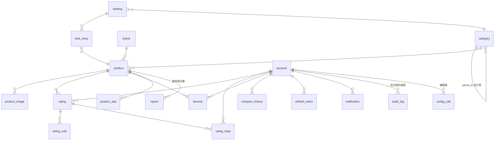

# 「有谱」数据库表结构设计

> 配套文档：《有谱-技术设计方案.md》v1.3
> 数据库：PostgreSQL 16 ｜ 版本：v1.1 ｜ 日期：2026-09-14（v1.1 新增 audit_log、config_rule，支撑后台管理系统）

---

## 1. 全局约定

| 项 | 约定 | 理由 |
|---|---|---|
| 主键 | `uuid`，应用层生成 **UUIDv7**（时间有序） | 将来分库/迁移无自增 ID 冲突；时间有序对索引友好。PG16 无内置 uuidv7，用 pg_uuidv7 扩展或应用侧生成 |
| 时间戳 | 所有表 `created_at` / `updated_at timestamptz`，默认 `now()` | updated_at 用触发器维护 |
| 软删除 | 核心内容表用 `status` 字段，物理删除仅用于用户注销 | 数据是资产，可回滚 |
| 动态属性 | 类目 schema、产品参数、评分分项等一律 `jsonb` + GIN 索引 | 多品类零 DDL 扩展 |
| 命名 | 表名单数、字段 snake_case；`user` 为保留字，表名用 `account` | 避免转义 |
| 外键 | 全部显式外键，`ON DELETE RESTRICT`（评论等用 CASCADE） | 单人项目靠数据库保证引用完整性 |
| 并发计数 | 点赞/收藏/浏览等计数用"异步聚合回写"，见 §8 | 热行更新是单人运营站最常见的性能坑 |
| 队列 | BullMQ（Redis 存储），不建队列表 | 见 §8 |

### ER 总览



---

## 2. 品类与产品域

### 2.1 category — 类目树（支持任意深度：运动 → 滑雪 → 单板）

```sql
CREATE TABLE category (
    id            uuid PRIMARY KEY,
    parent_id     uuid REFERENCES category(id),
    slug          text NOT NULL UNIQUE,          -- 'snowboard'
    name          text NOT NULL,                 -- '单板'
    level         smallint NOT NULL,             -- 1/2/3，冗余存层级便于查询
    path          ltree,                         -- 'sport.skiing.snowboard'，整棵子树查询用
    cover_url     text,
    sort_order    integer NOT NULL DEFAULT 0,
    spec_schema   jsonb,                         -- 叶子类目才填，见 §2.1.1
    recommend_config jsonb,                      -- 推荐引擎权重与硬过滤规则
    status        text NOT NULL DEFAULT 'active',-- active/inactive
    created_at    timestamptz NOT NULL DEFAULT now(),
    updated_at    timestamptz NOT NULL DEFAULT now()
);
CREATE INDEX idx_category_path ON category USING gist(path);
```

#### 2.1.1 spec_schema 结构规范（前端动态渲染 + seed 校验的共同契约）

```jsonc
{
  "fields": [
    { "key": "flex",      "label": "硬度",     "type": "int",       "min": 1, "max": 10,
      "filter": "range",  "compare": true,  "compareDirection": "neutral",
      "unit": "", "order": 10 },
    { "key": "profile",   "label": "板型",     "type": "enum",
      "options": ["camber","rocker","hybrid"],  "filter": "multi", "compare": true, "order": 20 },
    { "key": "terrain",   "label": "适用场景", "type": "enum[]",
      "options": ["all-mountain","park","carving","powder","beginner"],
      "filter": "multi", "compare": true, "order": 30 },
    { "key": "waist",     "label": "板腰宽",   "type": "number", "unit": "mm",
      "filter": "range", "compare": true, "compareDirection": "context", "order": 40 },
    { "key": "sizeChart", "label": "尺寸表",   "type": "nested",
      "itemSchema": { "length": "number", "heightMin": "number", "heightMax": "number",
                      "weightMin": "number", "weightMax": "number" },
      "filter": false, "compare": true, "order": 50 }
  ],
  "insights": [                                  // 客观分析规则也随类目声明，或放全局配置
    { "id": "stiff-for-beginner",
      "when": "flex >= 7 && recommendedLevel == 'beginner'",
      "template": "硬度 {flex}/10：需要至少一个雪季经验才能压住，新手慎选" }
  ]
}
```

> 字段级 `filter`/`compare` 决定筛选器、对比表是否渲染该列——新增类目不改一行前端代码。

### 2.2 brand

```sql
CREATE TABLE brand (
    id          uuid PRIMARY KEY,
    slug        text NOT NULL UNIQUE,
    name        text NOT NULL,
    name_cn     text,
    country     text,                            -- 'US' / 'AT' / ...
    logo_url    text,
    official_url text,
    description text,
    status      text NOT NULL DEFAULT 'active',
    created_at  timestamptz NOT NULL DEFAULT now(),
    updated_at  timestamptz NOT NULL DEFAULT now()
);
```

### 2.3 product — 核心表

```sql
CREATE TABLE product (
    id            uuid PRIMARY KEY,
    category_id   uuid NOT NULL REFERENCES category(id),
    brand_id      uuid NOT NULL REFERENCES brand(id),
    slug          text NOT NULL,                 -- 'burton-custom-2026'，全站唯一，URL 即此
    model         text NOT NULL,                 -- 'Custom'
    year          smallint NOT NULL,             -- 赛季/款型年份
    title         text NOT NULL,                 -- 'Burton Custom 2026'
    one_liner     text,                          -- 一句话点评（人写，AI 润色）
    price_min     numeric(10,2),
    price_max     numeric(10,2),
    price_currency char(3) NOT NULL DEFAULT 'CNY',
    cover_url     text,                          -- 底面主视觉
    specs         jsonb NOT NULL DEFAULT '{}',   -- 按 spec_schema.fields 校验后存入
    -- ↓ 评分/计数聚合回写列（异步，见 §8），读路径零计算
    rating_overall numeric(3,2),                -- 加权均分 0.00–5.00
    rating_count   integer NOT NULL DEFAULT 0,
    rating_sub     jsonb,                        -- {"flex":4.2,"stability":4.6,"forgiveness":3.1,"value":4.0}
    favorite_count integer NOT NULL DEFAULT 0,
    status         text NOT NULL DEFAULT 'draft',-- draft/published/archived
    data_source    text,                         -- 'official' / 'manual'，溯源
    published_at   timestamptz,
    created_at     timestamptz NOT NULL DEFAULT now(),
    updated_at     timestamptz NOT NULL DEFAULT now(),
    UNIQUE (brand_id, model, year)
);

CREATE INDEX idx_product_cat_status   ON product(category_id, status, year DESC);
CREATE INDEX idx_product_brand        ON product(brand_id);
CREATE INDEX idx_product_rating       ON product(rating_overall DESC NULLS LAST) WHERE status='published';
CREATE INDEX idx_product_price        ON product(price_min) WHERE status='published';
CREATE INDEX idx_product_specs_gin    ON product USING gin(specs jsonb_path_ops);
```

> 高频筛选字段（flex/terrain/…）的查询走 ES，PG 的 GIN 索引只兜底后台与低频查询。

### 2.4 product_image

```sql
CREATE TABLE product_image (
    id          uuid PRIMARY KEY,
    product_id  uuid NOT NULL REFERENCES product(id) ON DELETE CASCADE,
    url         text NOT NULL,                   -- COS 地址（webp）
    kind        text NOT NULL,                   -- base/face/side/shape/card3x4
    sort_order  smallint NOT NULL DEFAULT 0,
    alt         text,
    source      text,                            -- 图片来源标注（版权留痕）
    created_at  timestamptz NOT NULL DEFAULT now()
);
CREATE INDEX idx_image_product ON product_image(product_id, sort_order);
```

### 2.5 product_stat — 浏览与热度（与主表拆开，避免热更新拖垮 product）

```sql
CREATE TABLE product_stat (
    product_id    uuid PRIMARY KEY REFERENCES product(id) ON DELETE CASCADE,
    view_total    integer NOT NULL DEFAULT 0,
    view_7d       integer NOT NULL DEFAULT 0,    -- 定时任务滚动重算，热度排序用
    updated_at    timestamptz NOT NULL DEFAULT now()
);
-- 写入走 Redis INCR，定时刷回，见 §8
```

---

## 3. 用户与认证域

### 3.1 account

```sql
CREATE TABLE account (
    id            uuid PRIMARY KEY,
    email         text UNIQUE,                   -- v1 唯一登录方式
    phone         text UNIQUE,                   -- 预留
    nickname      text NOT NULL,
    avatar_url    text,
    rider_profile jsonb,                         -- {"height":175,"weight":70,"level":"intermediate","boot_size":43,"home_resort":"南山"}
    role          text NOT NULL DEFAULT 'user',  -- user/editor(数据录入员)/admin
    status        text NOT NULL DEFAULT 'pending',-- pending(未验证)/active/banned
    created_at    timestamptz NOT NULL DEFAULT now(),
    updated_at    timestamptz NOT NULL DEFAULT now()
);
```

- 邮箱验证码**不落表**，存 Redis：`code:{email}`，TTL 5min + 发送频率限制。
- rider_profile 在首次评论/推荐问卷时引导补全，是"同条件用户"信任机制的数据基础。

### 3.2 refresh_token

```sql
CREATE TABLE refresh_token (
    id          uuid PRIMARY KEY,
    account_id  uuid NOT NULL REFERENCES account(id) ON DELETE CASCADE,
    token_hash  text NOT NULL UNIQUE,            -- 只存哈希
    user_agent  text,
    ip          inet,
    expires_at  timestamptz NOT NULL,
    revoked_at  timestamptz,
    created_at  timestamptz NOT NULL DEFAULT now()
);
CREATE INDEX idx_rt_account ON refresh_token(account_id) WHERE revoked_at IS NULL;
```

### 3.3 audit_log — 后台操作审计（v1.1 新增，配合技术方案 §16 后台系统）

```sql
CREATE TABLE audit_log (
    id          bigint GENERATED ALWAYS AS IDENTITY PRIMARY KEY,  -- 高写入，identity 足够
    actor_id    uuid NOT NULL REFERENCES account(id),
    action      text NOT NULL,          -- create/update/delete/publish/hide/ban/role_change/config_edit
    entity      text NOT NULL,          -- product/category/brand/rating/account/config_rule...
    entity_id   uuid,
    before      jsonb,                  -- 变更前行快照（delete/hide 时必填）
    after       jsonb,
    ip          inet,
    created_at  timestamptz NOT NULL DEFAULT now()
);
CREATE INDEX idx_audit_entity  ON audit_log(entity, entity_id, created_at DESC);
CREATE INDEX idx_audit_actor   ON audit_log(actor_id, created_at DESC);
CREATE INDEX idx_audit_time    ON audit_log(created_at DESC);
-- 写入方：当前本地 M3 由 AdminService 统一审计 helper 落表；切换多账号/JWT 后可下沉为 Prisma middleware
-- 保留 2 年后归档 COS；jsonb 快照使"误删恢复"可按 before 逐条回放
```

---

## 4. 评分评论域

### 4.1 rating — 一条评分 = 一次评价（分数+文字一体）

```sql
CREATE TABLE rating (
    id            uuid PRIMARY KEY,
    product_id    uuid NOT NULL REFERENCES product(id) ON DELETE CASCADE,
    account_id    uuid NOT NULL REFERENCES account(id) ON DELETE CASCADE,
    overall       numeric(2,1) NOT NULL CHECK (overall BETWEEN 1 AND 5),
    sub           jsonb NOT NULL DEFAULT '{}',   -- 按类目 rating_dimensions 校验
    content       text,
    rider_profile jsonb NOT NULL DEFAULT '{}',   -- 提交时快照！用户后来改资料不影响历史评论可信度
    source        text NOT NULL DEFAULT 'user',  -- user/seed(冷启动种子)
    status        text NOT NULL DEFAULT 'published', -- published/hidden/removed
    helpful_count integer NOT NULL DEFAULT 0,    -- 异步聚合回写
    created_at    timestamptz NOT NULL DEFAULT now(),
    updated_at    timestamptz NOT NULL DEFAULT now(),
    UNIQUE (product_id, account_id)              -- 一人一板一评，可编辑
);
CREATE INDEX idx_rating_product ON rating(product_id, status, helpful_count DESC, created_at DESC);
```

> `sub` 的分项维度挂在 `category.spec_schema.rating_dimensions`：
> 滑雪板 = 弹性/稳定/容错/性价比；跑步鞋 = 缓震/支撑/耐久/包裹。前端与校验读同一份定义。

### 4.2 rating_vote — "有帮助"投票

```sql
CREATE TABLE rating_vote (
    rating_id   uuid REFERENCES rating(id) ON DELETE CASCADE,
    account_id  uuid REFERENCES account(id) ON DELETE CASCADE,
    created_at  timestamptz NOT NULL DEFAULT now(),
    PRIMARY KEY (rating_id, account_id)
);
```

### 4.3 rating_reply — 评论回复（一层，不做无限楼中楼）

```sql
CREATE TABLE rating_reply (
    id          uuid PRIMARY KEY,
    rating_id   uuid NOT NULL REFERENCES rating(id) ON DELETE CASCADE,
    account_id  uuid NOT NULL REFERENCES account(id) ON DELETE CASCADE,
    reply_to    uuid REFERENCES account(id),     -- @某人
    content     text NOT NULL,
    status      text NOT NULL DEFAULT 'published',
    created_at  timestamptz NOT NULL DEFAULT now()
);
CREATE INDEX idx_reply_rating ON rating_reply(rating_id, created_at);
```

### 4.4 report — 举报队列（先发后审的兜底）

```sql
CREATE TABLE report (
    id            uuid PRIMARY KEY,
    target_type   text NOT NULL,                 -- rating/reply/product
    target_id     uuid NOT NULL,
    reporter_id   uuid NOT NULL REFERENCES account(id),
    reason        text NOT NULL,                 -- enum 值：spam/abuse/bias/other
    note          text,
    status        text NOT NULL DEFAULT 'open',  -- open/resolved/rejected
    handled_by    uuid REFERENCES account(id),
    created_at    timestamptz NOT NULL DEFAULT now(),
    UNIQUE (target_type, target_id, reporter_id) -- 同一举报人对同一目标只计一次
);
CREATE INDEX idx_report_open ON report(status, created_at) WHERE status='open';
```

---

## 5. 留存域

### 5.1 favorite

```sql
CREATE TABLE favorite (
    account_id  uuid REFERENCES account(id) ON DELETE CASCADE,
    product_id  uuid REFERENCES product(id) ON DELETE CASCADE,
    created_at  timestamptz NOT NULL DEFAULT now(),
    PRIMARY KEY (account_id, product_id)
);
CREATE INDEX idx_fav_product ON favorite(product_id);   -- 反查"谁收藏了我"、聚合计数
```

### 5.2 compare_history — 对比历史（登录用户聚合，匿名存 cookie，v1 只留登录态）

```sql
CREATE TABLE compare_history (
    id            uuid PRIMARY KEY,
    account_id    uuid NOT NULL REFERENCES account(id) ON DELETE CASCADE,
    category_id   uuid REFERENCES category(id),
    product_ids   uuid[] NOT NULL,               -- 顺序即对比列顺序
    created_at    timestamptz NOT NULL DEFAULT now()
);
CREATE INDEX idx_cmp_account ON compare_history(account_id, created_at DESC);
```

### 5.3 notification

```sql
CREATE TABLE notification (
    id          bigint GENERATED ALWAYS AS IDENTITY PRIMARY KEY,  -- 高写入表用 identity 而非 uuid
    account_id  uuid NOT NULL REFERENCES account(id) ON DELETE CASCADE,
    type        text NOT NULL,                   -- rating_replied/voted/liked/system
    actor_id    uuid REFERENCES account(id),     -- 触发者
    target_type text, target_id uuid,            -- 跳转目标
    payload     jsonb NOT NULL DEFAULT '{}',     -- 冗余展示所需内容，免 join
    read_at     timestamptz,
    created_at  timestamptz NOT NULL DEFAULT now()
);
CREATE INDEX idx_notif_unread ON notification(account_id, created_at DESC) WHERE read_at IS NULL;
-- 保留策略：90 天后归档清理
```

---

## 6. 榜单域

### 6.1 ranking / rank_entry / ranking_vote

```sql
CREATE TABLE ranking (
    id          uuid PRIMARY KEY,
    category_id uuid NOT NULL REFERENCES category(id),
    slug        text NOT NULL UNIQUE,            -- 'snowboard-first-board-2026'
    title       text NOT NULL,                   -- '2026 新手第一块板'
    description text,
    method      text NOT NULL,                   -- manual/data/community —— 榜单生成方式，详情页要外显以自证客观
    season      text,                            -- '2025-2026'
    cover_url   text,
    status      text NOT NULL DEFAULT 'draft',   -- draft/published/archived
    published_at timestamptz,
    created_at  timestamptz NOT NULL DEFAULT now(),
    updated_at  timestamptz NOT NULL DEFAULT now()
);

CREATE TABLE rank_entry (
    ranking_id  uuid REFERENCES ranking(id) ON DELETE CASCADE,
    product_id  uuid REFERENCES product(id) ON DELETE RESTRICT,
    position    smallint NOT NULL,
    score       numeric(6,2),                    -- 综合分（数据+社区）
    note        text,                            -- 上榜理由一句话
    PRIMARY KEY (ranking_id, product_id)
);

CREATE TABLE ranking_vote (                                  -- 社区投票（榜单参与感）
    ranking_id  uuid REFERENCES ranking(id) ON DELETE CASCADE,
    account_id  uuid REFERENCES account(id)  ON DELETE CASCADE,
    product_id  uuid REFERENCES product(id)  ON DELETE RESTRICT,
    created_at  timestamptz NOT NULL DEFAULT now(),
    PRIMARY KEY (ranking_id, account_id, product_id)
);
```

---

## 7. 数据管线域（录入与同步）

### 7.1 data_source — 采集批次留痕

```sql
CREATE TABLE data_source (
    id           uuid PRIMARY KEY,
    brand_id     uuid REFERENCES brand(id),
    origin_url   text NOT NULL,                  -- 采集来源页
    kind         text NOT NULL,                  -- crawl/manual
    snapshot_url text,                           -- 网页快照存档 COS（参数争议时的证据）
    ingested_at  timestamptz NOT NULL DEFAULT now()
);
```
`product.data_source` / `product_image.source` 引用此表 id，全部参数可溯源。

### 7.2 outbox_event — 事件发件箱（可靠同步的枢纽）

```sql
CREATE TABLE outbox_event (
    id           bigint GENERATED ALWAYS AS IDENTITY PRIMARY KEY,
    aggregate    text NOT NULL,                  -- product/rating/favorite/...
    aggregate_id uuid NOT NULL,
    type         text NOT NULL,                  -- product.updated/rating.changed/recount.required
    payload      jsonb NOT NULL DEFAULT '{}',
    processed_at timestamptz,                    -- NULL = 待处理
    attempts     smallint NOT NULL DEFAULT 0,
    created_at   timestamptz NOT NULL DEFAULT now()
);
CREATE INDEX idx_outbox_pending ON outbox_event(id) WHERE processed_at IS NULL;
```

**一条链路解决三件事**：业务写 PG 的同事务内 insert 事件 → 后台 worker 消费：
1. 重算评分/收藏聚合并回写 `product.rating_*`
2. 同步变更到 ES
3. 触发通知（新回复/新点赞）

杜绝"改了库忘了刷缓存/索引"这一类最耗单人开发者生命力的 bug。

### 7.3 config_rule — 领域配置中心（v1.1 新增，技术方案 §16.2：配置从文件升格为 DB 版本化）

```sql
CREATE TABLE config_rule (
    id           uuid PRIMARY KEY,
    kind         text NOT NULL,                   -- recommend_mapping(身高体重→板长/水平→硬度映射) | insight_rule(客观分析规则) | sensitive_word | weight_config
    key          text NOT NULL,                   -- 组标识，如 'snowboard/size-chart'、规则 id
    payload      jsonb NOT NULL,                  -- 规则内容，按 kind 用 zod 校验
    active       boolean NOT NULL DEFAULT true,
    version      integer NOT NULL DEFAULT 1,
    updated_by   uuid REFERENCES account(id),
    created_at   timestamptz NOT NULL DEFAULT now(),
    updated_at   timestamptz NOT NULL DEFAULT now(),
    UNIQUE (kind, key, version)                   -- 编辑即新增 version 行，active 互斥切换 → 天然回滚
);
CREATE INDEX idx_config_active ON config_rule(kind, key) WHERE active;
```
- 消费方：推荐引擎（§6 映射表与权重）、客观分析引擎（洞察规则）、评论敏感词。
- 读取路径：进程内缓存 + 订阅 `outbox_event(type='config.changed')` 失效，规则调整分钟级生效、不发版；每次生效版本记入 `recommend_log.rule_version`（推荐结果可追溯到当时的规则集）。
- 边界：只存**领域配置**（会被运营改的东西）；技术配置（连接串/开关）仍走环境变量与 Git。

---

## 8. 计数与聚合的回写策略

| 数据 | 实时层 | 回写 | 频率 |
|---|---|---|---|
| product.rating_* / rating_sub | outbox 事件触发重算 | PG + ES | 秒级 |
| favorite_count / helpful_count | Redis INCR + outbox | PG + ES | 分钟级 |
| product_stat 浏览量 | Redis `HINCRBY views:{date}` | 定时任务刷 PG + ES `view_7d` | 每小时 |
| 推荐结果缓存 | Redis，key = 问卷参数哈希 | – | TTL 1天，数据更新时按类目批量失效 |
| config_rule 领域配置 | 进程内缓存 | 订阅 outbox `config.changed` 失效 | 分钟级生效，不发版（§7.3） |

---

## 9. Elasticsearch 文档映射（同步目标，供参考）

```jsonc
// 索引：youpu-products（类目 >10 个后按大类拆分：youpu-sports / ...）
{
  "mappings": {
    "properties": {
      "id":          { "type": "keyword" },
      "title":       { "type": "text", "analyzer": "ik_max_word", "search_analyzer": "ik_smart",
                       "fields": { "suggest": { "type": "search_as_you_type" } } },
      "brand":       { "type": "keyword" },
      "categoryPath":{ "type": "keyword" },
      "year":        { "type": "short" },
      "priceMin":    { "type": "float" },
      "rating":      { "type": "float" },
      "ratingCount": { "type": "integer" },
      "view7d":      { "type": "integer" },
      "oneLiner":    { "type": "text", "analyzer": "ik_max_word" },
      "specs":       { "type": "object", "dynamic": true }   // 按 spec_schema 拍平为 keyword/数值列
    }
  }
}
```

- `specs` 同步脚本按 `spec_schema.fields` 把 `filter: range|multi` 的字段拍平成可聚合列——**筛选器分面全部来自 ES**，PG 不掺和。
- 新增类目后需 `PUT _mapping` 补字段：类目上线脚本包含此步骤，避免 dynamic mapping 猜错类型。

---

## 10. 规模演进路线（预留，不做提前优化）

| 触发点 | 动作 |
|---|---|
| 类目 > ~10 且字段差异大 | ES 按大类拆索引；`category.spec_schema` 不变 |
| product 行数 > 500 万 | 按 `category_id` 哈希分表（pg_partman），或按 `year` 分区 |
| rating 单表 > 千万行 | 按 `product_id` 哈希分区（PG 原生 declarative partitioning） |
| notification 堆积 | 90 天归档到冷表 |
| 读写分离 | 读走只读副本；outbox worker 只跑主库 |
| 全站只读压测不过 | CDN 页面级缓存（榜单/详情），命中即不过源 |

---

## 11. 落地清单（M1 执行）

1. 迁移工具：Prisma（与 NestJS 契合）或 Flyway——**建议 Prisma**，schema 即 TS 类型，前端共享。
2. 首批 migration：§2–§7 全部建表（含 v1.1 的 audit_log、config_rule）+ 触发器（updated_at）+ seed 的 `category`（单板）与 spec_schema。
3. 校验：`packages/schema` 用 zod 实现 spec_schema 解释器，导入脚本、后台动态表单、前端筛选共用同一份。
4. outbox worker 骨架：rating.recount / product.es-sync / notification / config.changed 四个 consumer。
5. 本地 compose 起 PG/Redis/ES，灌 3 块示例板数据，全链路通。
6. Prisma middleware：`/api/admin/*` 写操作自动落 audit_log（before/after 快照），业务代码零手写。
